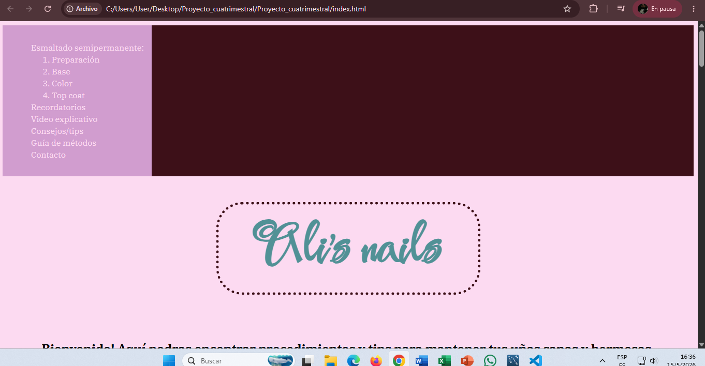
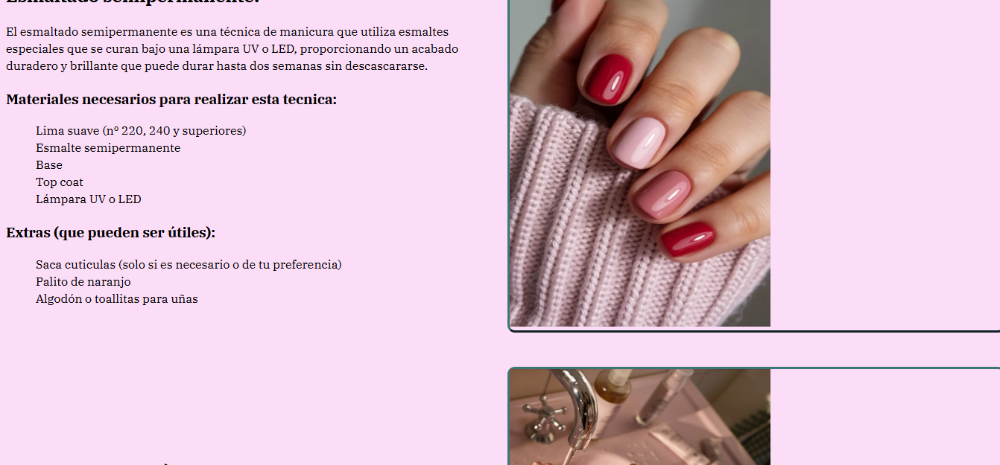
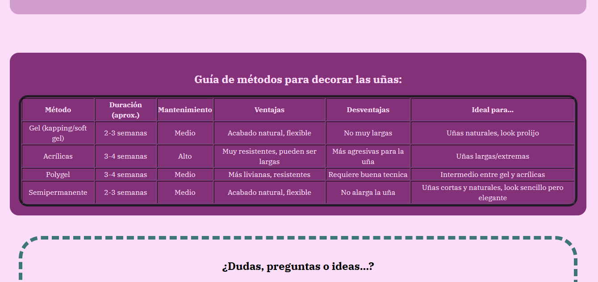
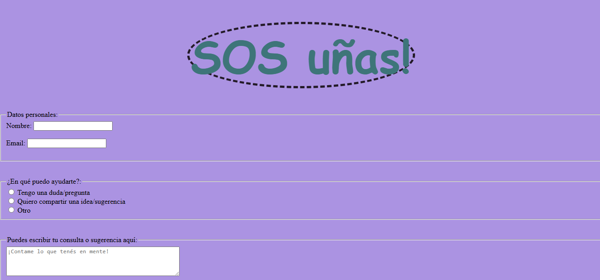
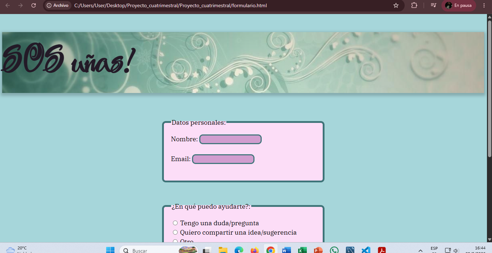
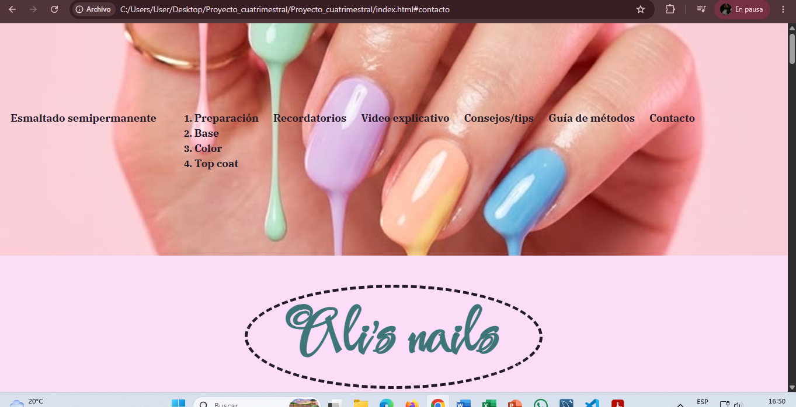
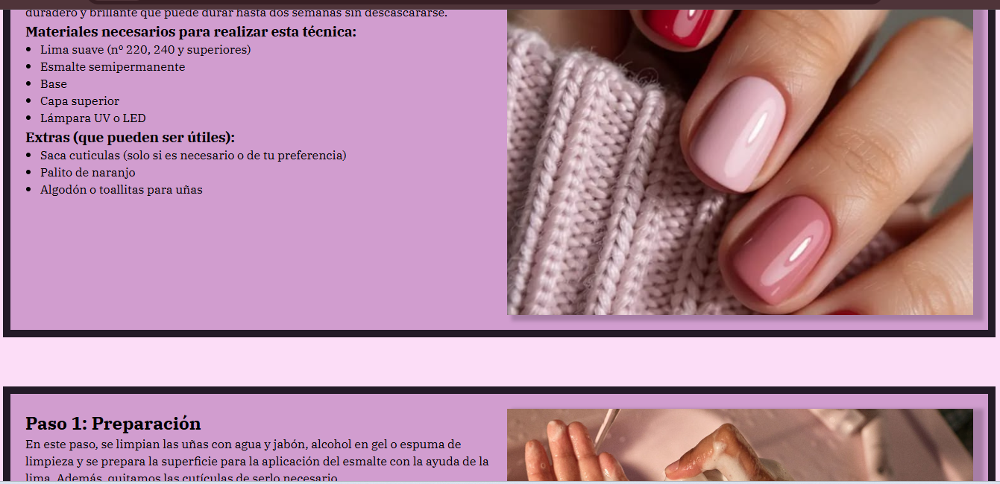
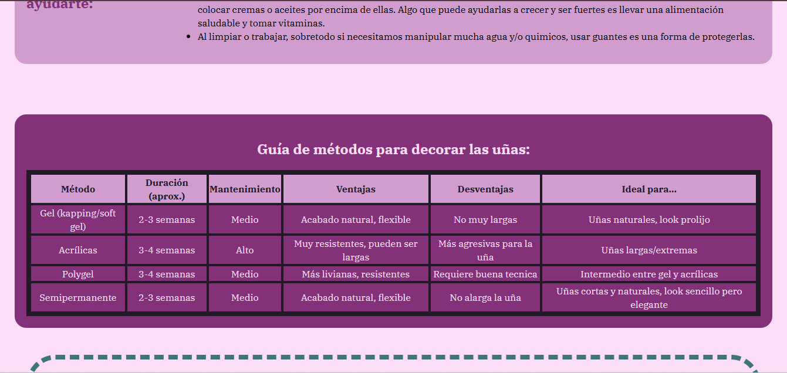
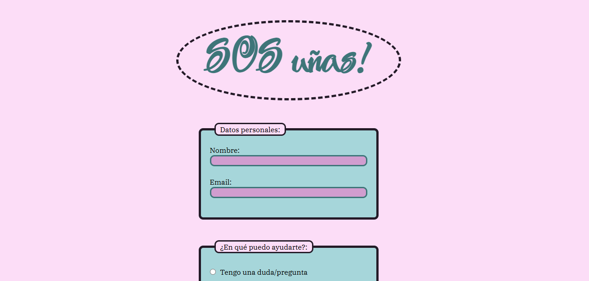

# Mi página web: "Ali's nails" (Proyecto cuatrimestral)

## Descripción
Este proyecto esta enfocado en dar una guía paso a paso sobre el esmaltado semipermanente,
además de brindar consejos para un mejor resultado. Es un sitio pensado para resolver dudas comunes y enseñar la técnica de forma clara y organizada.

## Contenido
- Menú principal en donde se puede acceder rapidamente a cada parte de la página.
- Contiene un tutorial paso a paso completo sobre esmaltado semipermanente (Preparación, Base, Color y    Top Coat).
- Video de youtube sobre el esmaltado semipermanente para visualizar la técnica.
- Ofrece consejos y tips útiles.
- Incluye una tabla con información extra sobre otras técnicas de manicuria.
- Contiene un enlace a un formulario de contacto para dudas, consultas o ideas y sugerencias.
- Además, presenta enlaces a mis redes sociales (instagram y canal de youtube).

## Autor
Schneeberger Alison

## Capturas del proceso de diseño:

 

## Capturas del diseño final:

## MENÚ

## SECCIÓNES TUTORIAL

## TABLA

## PÁGINA FORMULARIO
